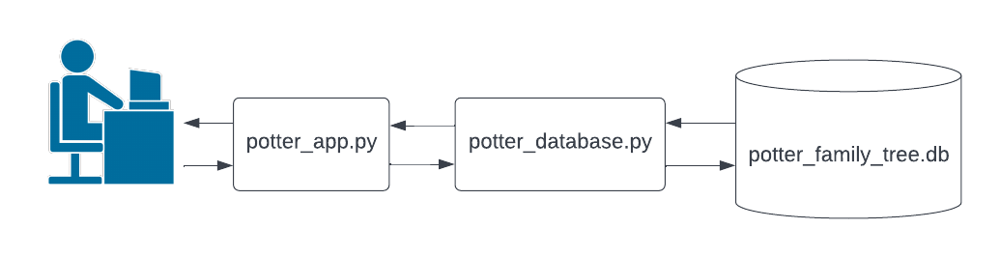

# More of the Python Module sqlite3

## Last time

Last time we saw how to use the Python module sqlite3 to connect to a database, and execute SQLite commands (such as inserting and deleting data). The following files that were discussed last time can be found in this directory:

* ``potter_family_tree.db``
* ``potter_database.py``
* ``potter_app.py``

Recall that the ``.db`` file is a database holding family tree information. The ``.py`` files are organized so that ``potter_database.py`` interacts with the database via SQL commands executed using the sqlite3 module. The user will interact with the program ``potter_app.py`` which holds the logic for all user interaction. The program ``potter_app.py`` does not contain any SQL commands; instead it imports all the necessary functions to interact with the database from ``potter_database.py``. The interactions between the user and the files are summarized in the following diagram:



## Fetching data

Last time we showed how to use the sqlite3 module to insert and delete data from a database. This time we we see how to fetch (i.e. extract) data from a database. To do so, we can use the following methods of a cursor object:

* ``fetchone()``
* ``fetchall()``
* ``fetchmany(size)``

You can read all about these methods in the [module's api](https://docs.python.org/3/library/sqlite3.html#cursor-objects). Briefly, the ``fetchone()`` method will return a single row of data from a SQL query as a tuple,  ``fetchall()``  will return all the rows of data from a SQL query as a list (of tuples), and ``fetchmany(size)`` will return the list of the first ``size`` rows of data. These fetch-methods should be called after the appropriate execute method. For example, the following two lines will give all the rows of the ``Person`` table:

```
cur.execute("SELECT * FROM Person;")

rows = cur.fetchall()
```

Similarly, the following will give the first 4 rows of the ``Person`` table:

```
cur.execute("SELECT * FROM Person;")

rows = cur.fetchmany(4)
```

Finally, the following will give the (unique) row in the ``Person`` table with ``personKey`` equal to 5:

```
cur.execute("SELECT * FROM Person WHERE personKey = 5;")

row = cur.fetchone()
```

You can play with these methods using the file ``fetching_practice.py``.

#### Functions that return data

Using these fetch-methods, we can write functions that return values from the table. For example, the following function returns all the rows from the ``Person`` as a list of tuples:

```python
def get_all_people():
    '''Returns a list of all the data in the Person table'''
    
    # Create a connection to the database
    conn = sqlite3.connect('potter_family_tree.db')

    # Create a cursor object
    cur = conn.cursor()
    
    # Turn on foreign_key constraints
    cur.execute("PRAGMA foreign_keys = ON;")

    # Write a SQL query to get all data from the Person table:
    cur.execute("SELECT * FROM Person;")
    
    # Fetch all the resulting rows into a list
    rows = cur.fetchall()

    # Commit (i.e. save) the changes
    conn.commit()

    # Close the connection
    conn.close()
    
    # Don't forget to return the rows!
    return rows
```

As another example, the following function returns the first name of the person with the given person key:

```python
def get_first_name(person_key):
    '''Returns the first name of the person with the given key'''
    
    # Create a connection to the database
    conn = sqlite3.connect('potter_family_tree.db')

    # Create a cursor object
    cur = conn.cursor()
    
    # Turn on foreign_key constraints
    cur.execute("PRAGMA foreign_keys = ON;")

    # Write a SQL query to get the first name of the person:
    cur.execute('''
                SELECT firstName 
                FROM Person 
                WHERE personKey = ?;
                ''', (person_key,))
    
    # Fetch the resulting row as a tuple
    row = cur.fetchone()
    
    # Extract the only element (i.e. the first name) from the tuple
    first = row[0]

    # Commit (i.e. save) the changes
    conn.commit()

    # Close the connection
    conn.close()
    
    # don't forget to return the first name!
    return first
```

## Updated Potter App

The files ``potter_database.py`` and ``potter_app.py`` have been updated to illustrate some of these fetching-functions in action. In particular, you can see more examples of functions that use the fetch-methods in ``potter_database.py``. You can play with ``potter_app.py`` to see how these functions have been used to give the app more options. Take a look and let me know if you have any questions!

